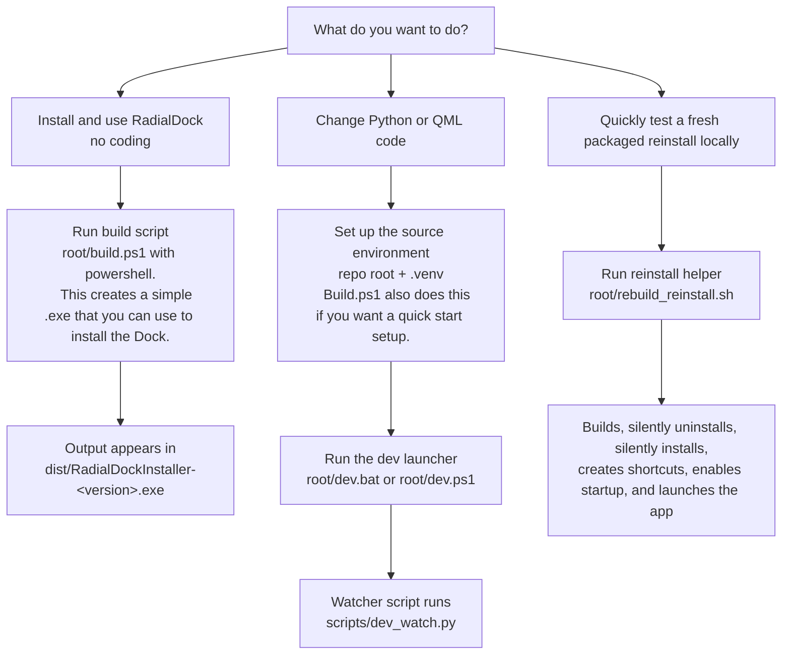

# RadialDock

## Project Overview

**RadialDock** is a Windows launcher that shows a **radial menu** near the cursor. You pin files, folders, apps, and shortcuts on the ring, open nested folders and groups, and adjust behavior from an in-app settings panel.

**Tech stack:** Python application using **PySide6** (Qt 6) with the **Qt Quick** UI written in **QML** (`ui/`). Windows-specific pieces use the Win32 API and shell COM where needed (`pywin32`).

https://github.com/user-attachments/assets/e17b115a-a539-4d00-aa30-3c99df3c2667

---

## Which Path Should I Use?

If you only want to use RadialDock, download the packaged installer EXE. You do **not** need Python, Git, or the source code.

Developers create the packaged installer at `dist/RadialDockInstaller-<version>.exe` by running `build.ps1`. On GitHub, the same EXE should usually be downloaded from the project's Releases/download area; a fresh source checkout may not include `dist/` unless release artifacts are published there.



| Goal | Audience | Use | Location |
|------|----------|-----|----------|
| Install and use RadialDock without coding | Normal users / testers | `RadialDockInstaller-<version>.exe` | GitHub Releases/download area, or `dist/` after a developer build |
| Run from source while editing code | Developers | `dev.bat` or `.\dev.ps1` | Repo root |
| Run the watcher directly | Developers | `python scripts/dev_watch.py` | `scripts/dev_watch.py` |
| Build the packaged installer | Developers / release builders | `.\build.ps1` | Repo root, output in `dist/` |
| Rebuild and reinstall locally | Developers testing packaged installs | `./rebuild_reinstall.sh` | Repo root, run from Git Bash or another Bash shell |

---

## Install From The Packaged EXE

For non-coder users, this is the simplest path:

1. Download `RadialDockInstaller-<version>.exe` from the GitHub Releases/download area.
2. Download only the EXE, not the source code ZIP, unless you plan to build or run from code.
3. Run the EXE.
4. Choose the install options when prompted.
5. Open the dock with **Ctrl+Space**.

The packaged EXE is self-installing:

- Double-clicking the EXE with no flags opens an install/uninstall prompt when applicable.
- `--install` installs RadialDock.
- `--uninstall` removes RadialDock.
- `--silent` skips prompts and uses the script defaults.

Examples:

The `.\dist\` path below is for developers running commands from the repo root. If you downloaded the EXE somewhere else, double-click it or run it from that download location.
Replace `<version>` with the version in the actual filename you downloaded or built.

```powershell
.\dist\RadialDockInstaller-<version>.exe --install
.\dist\RadialDockInstaller-<version>.exe --uninstall
.\dist\RadialDockInstaller-<version>.exe --install --silent
.\dist\RadialDockInstaller-<version>.exe --uninstall --silent
```

Installed app behavior:

- The installed runtime is copied to `%LocalAppData%\RadialDock\RadialDock.exe`.
- Interactive install asks whether to create Start Menu and desktop shortcuts.
- Interactive install asks whether RadialDock should launch when Windows starts.
- Silent install answers yes to the install choices: shortcuts are created, startup is enabled, and the app launches after install.
- Uninstall removes the installed runtime, shortcuts, startup shortcut, install marker, config, and cache under `%LocalAppData%\RadialDock`.

---

## Run From Source While Developing

Use this path when you are changing Python or QML and want the app to restart automatically after saves.

1. Clone this repository.

2. Create a virtual environment and install the package in editable mode from the repo root:

   ```powershell
   python -m venv .venv
   .\.venv\Scripts\Activate.ps1
   python -m pip install -r requirements.txt
   python -m pip install -e .
   ```

3. Start the development watcher:

   ```powershell
   .\dev.ps1
   ```

   You can also double-click `dev.bat` in the repo root, or run the watcher directly:

   ```powershell
   python scripts/dev_watch.py
   ```

4. Open the dock with **Ctrl+Space**.

Development launcher behavior:

- `dev.bat` is a double-click wrapper that runs `dev.ps1` and forwards arguments.
- `dev.ps1` uses `.venv\Scripts\python.exe` when it exists; otherwise it falls back to `python` on `PATH`.
- `dev.ps1` avoids starting a second watcher for the same checkout unless you pass `-Force`.
- `scripts/dev_watch.py` watches `src/radialdock/` and `ui/` for `.py` and `.qml` changes.
- The watcher restarts `python -m radialdock.app`; it is restart-on-save, not true hot reload.
- The watcher sets `RADIALDOCK_DEV=1` only on the child app process so dev restarts do not get blocked by the first-run install/manage prompt.

Common developer commands:

```powershell
.\dev.ps1
.\dev.ps1 -Force
.\dev.ps1 -- --portable
.\dev.ps1 -Force -- --portable
```

Arguments after `--` are forwarded to the app. For example, `--portable` stores config under `.radialdock/` in the current working directory.

Stop the watcher with **Ctrl+C** in the watcher console.

---

## Build The Packaged Installer

Use this when you need a new `RadialDockInstaller-<version>.exe`.

```powershell
.\build.ps1
```

Build behavior:

- Uses or creates `.venv` under the repo root.
- Requires Python **3.13.x** for reproducible installer builds.
- If `.venv` already exists, it must be Python **3.13.x** or the build stops with a clear error.
- Installs the locked dependency set from `requirements-lock.txt`.
- Reads the app version from `VERSION.txt`.
- Writes the installer to `dist/RadialDockInstaller-<version>.exe`.
- Writes build diagnostics to `dist/RadialDock-build-info-<version>.json`.

Day-to-day source development does not require `build.ps1` unless you are testing packaged installer behavior.

---

## Rebuild And Reinstall Locally

Use this when you are testing the packaged app and want a fresh local reinstall in one command.

Run from Git Bash or another shell with `bash`:

```bash
./rebuild_reinstall.sh
```

This helper:

1. Runs `build.ps1`.
2. Reads `VERSION.txt`.
3. Runs the matching `dist/RadialDockInstaller-<version>.exe --uninstall --silent`.
4. Runs the same installer with `--install --silent`.

Important: because this uses silent install, it creates shortcuts, enables launch on Windows startup, and launches RadialDock after installation.

---

## Project Structure

| Path | Role |
|------|------|
| `src/radialdock/` | Application code: entrypoint, model, hotkey, install helpers, cache, shell integration |
| `ui/` | Qt Quick (QML) UI |
| `scripts/dev_watch.py` | Development file watcher and app restarter |
| `dev.bat` | Double-click developer launcher for Windows |
| `dev.ps1` | PowerShell developer launcher with single-instance guard |
| `build.ps1` | PyInstaller packaging script |
| `rebuild_reinstall.sh` | Git Bash helper for packaged rebuild/reinstall testing |
| `docs/` | Extra development documentation |
| `build/` | Generated build work files; not needed for normal use |
| `dist/` | Generated packaged installers and build-info JSON files |

---

## Notes

- **Windows focus:** The product targets Windows because it uses global hotkeys, shell shortcuts, and Windows Known Folders.
- **Default hotkey:** **Ctrl+Space** may conflict with other apps. Change it in RadialDock Settings if needed.
- **Back action:** Right-click is the universal Back action inside the overlay.
- **Python versions:** `pyproject.toml` allows Python >= 3.11 for normal editable source installs. `build.ps1` requires Python 3.13.x for installer builds.
- **Dependencies:** Runtime deps are listed in `requirements.txt`. Reproducible installer builds use `requirements-lock.txt`.
- **Generated files:** `build/` and `dist/` are generated locally. If you are browsing source on GitHub and do not see `dist/`, download the installer from the release/download area instead.

---

## License

See [`LICENSE`](LICENSE).
